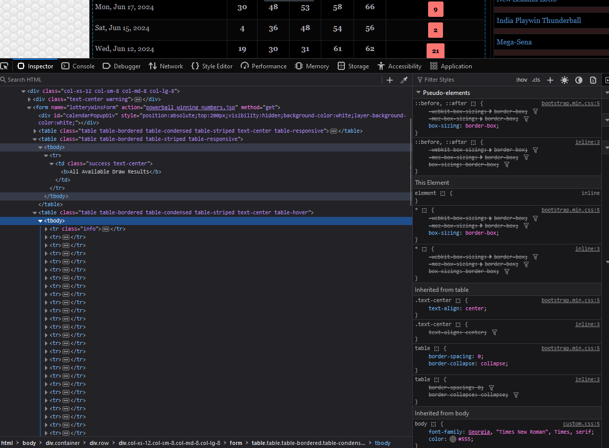

# lottery-number-generator
A program that takes previous lottery wins and gives you the best numbers

# How it Works
1. Go to one of the websites down below:

    Powerball: https://www.portalseven.com/lottery/powerball_winning_numbers.jsp?fromDate=1900-01-01&toDate=2024-08-32&viewType=3
    Mega Millions: https://portalseven.com/lottery/megamillions_winning_numbers.jsp?fromDate=2023-08-31&toDate=2024-08-31&viewType=3
2. Click the Get Numbers Button next to View All Results
3. Right click with your mouse and click inspect
4. Find this part of the HTML code:
    
5. Then click Copy:
   - If it is Firefox choose Copy then Inner HTML
   - If it is Chrome chose Copy then Copy element
6. Take what you have copied and replace what is in the txt file called lotterySite.txt
7. Run the code

# Helpful Info
- It just says Powerball because I originally wrote it for the powerball.
    It works just as well for Mega Millions in the US
- THIS WILL NOT WIN YOU THE LOTTERY. IT JUST TELLS YOU THE MOST LIKELY NUMBERS.
